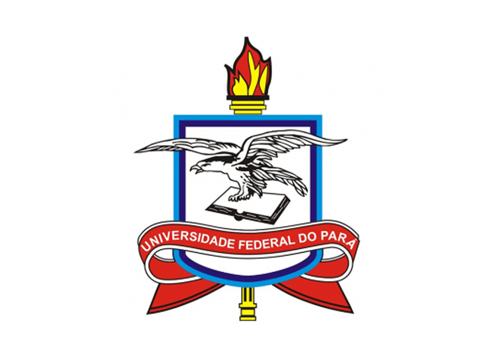
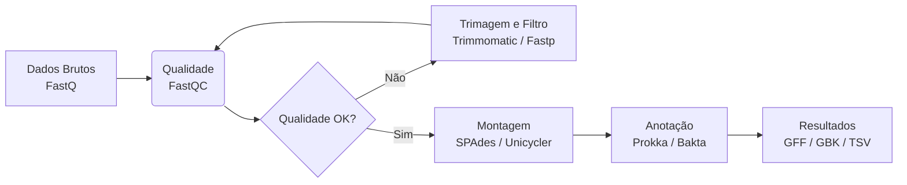

## Sobre o Projeto IWASA'I

Este curso é uma iniciativa do **Projeto IWASA'I** – uma ação de treinamento e capacitação em genômica e bioinformática voltada para a formação de pesquisadores na região amazônica. Esta inicitativa reflete o compromisso com a ciência aberta, a soberania tecnológica e a valorização da biodiversidade da Amazônia.

O treinamento é oferecido pelo **Laboratório de Engenharia Biológica (EngBio)** da **Universidade Federal do Pará (UFPA)**.

  
  
  

# Introdução à Genômica de Microrganismos

Bem-vindo(a) ao repositório oficial do curso de **Introdução à Genômica de Microrganismos**. Este material foi desenvolvido para guiar estudantes e pesquisadores iniciantes através dos fundamentos da genômica, desde a extração do DNA até a interpretação biológica dos dados, utilizando ferramentas de bioinformática.

---

## O que é Genômica?

A **Genômica** é o ramo da biologia molecular dedicado ao estudo do conjunto completo de DNA (genoma) de um organismo, incluindo seus genes, sequências regulatórias e regiões não codificantes. Diferente da genética clássica, que foca em genes específicos, a genômica analisa o genoma como um todo, buscando entender a estrutura, função, evolução e interações deste material genético.

No contexto de **microrganismos** (bactérias, arqueias, fungos e vírus), a genômica é especialmente poderosa. Genomas bacterianos, por exemplo, são relativamente pequenos (variando de 0,5 a 10 Mb), o que os torna mais acessíveis para estudos completos e montagem *de novo*.

### Exemplos de estudos genômicos:
- **Genômica Comparativa**: Comparar o genoma de uma cepa patogênica com uma cepa não patogênica para identificar genes de virulência.
- **Metagenômica**: Sequenciar todo o DNA de uma amostra ambiental (ex: solo, intestino humano) para descobrir quais microrganismos estão presentes e o que eles fazem.
- **Filogenômica**: Utilizar o genoma completo para construir árvores evolutivas mais precisas do que as baseadas em um único gene (como o 16S rRNA).

---

## Sobre o Sequenciamento de DNA

Para estudar o genoma, precisamos "ler" a ordem dos nucleotídeos (A, T, C, G). O **Sequenciamento de DNA** é a tecnologia que permite fazer isso.

### Evolução tecnológica:
1.  **Sanger (1ª Geração)**: Precisa e lenta, usada para sequenciar pequenos fragmentos (até ~900 pb). Ainda é o "padrão ouro" para validações.
2.  **NGS (Sequenciamento de Nova Geração)**: Tecnologias como Illumina (MiSeq, HiSeq) que geram milhões de fragmentos curtos (*reads*) de forma massivamente paralela. É a mais utilizada atualmente para genomas bacterianos (tamanho de *reads*: 150-300 pb).
3.  **Terceira Geração (Long-Reads)**: Tecnologias como Nanopore (Oxford) e PacBio. Geram *reads* muito longos (milhares a milhões de pares de base), excelentes para resolver regiões repetitivas e completar o genoma (*closed genome*).

---

## Aplicações da Genômica Microbiana

A genômica de microrganismos revolucionou diversas áreas:

- **Saúde Pública e Epidemiologia**: Rastreamento de surtos infecciosos (ex: *Salmonella*, *E. coli*, SARS-CoV-2) através da filogenia, permitindo identificar a origem do contágio.
- 💊 **Indústria Farmacêutica**: Descoberta de novos antibióticos e enzimas de interesse biotecnológico (como as enzimas de restrição e polimerases).
- 🌱 **Agronomia**: Estudo de microrganismos fixadores de nitrogênio e promotores de crescimento vegetal.
- ♻️ **Biorremediação**: Identificação de genes que permitem a degradação de poluentes (plástico, petróleo) por bactérias.
- 🧫 **Biologia Sintética**: Utilização de genomas simplificados ou modificados para criar fábricas celulares produtoras de biocombustíveis ou insulina.

---

## Bioinformática: A Ponte entre Dados e Conhecimento

A bioinformática é uma área interdisciplinar que combina **Biologia**, **Ciência da Computação**, **Matemática** e **Estatística** para coletar, armazenar, processar e analisar dados biológicos.

Com o advento do NGS, a capacidade de gerar dados cresceu exponencialmente (um único sequenciador Illumina gera centenas de Gigabytes por corrida). **Processar isso manualmente é impossível**. A bioinformática entra exatamente aqui, fornecendo algoritmos e pipelines para transformar os *reads* brutos (sinais eletrônicos) em informações biológicas significativas (genes, funções, árvores evolutivas).

> *"Biologia molecular sem bioinformática é como ter uma biblioteca inteira com livros escritos em uma língua desconhecida, sem índice e sem luz."*

---

## Pipeline de Bioinformática para Genomas Bacterianos

Neste curso, você aprenderá na prática como construir e executar um pipeline completo de análise de dados de sequenciamento (Illumina). O fluxograma abaixo representa o passo a passo que aplicaremos:

