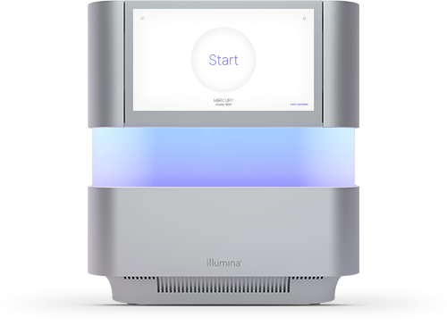
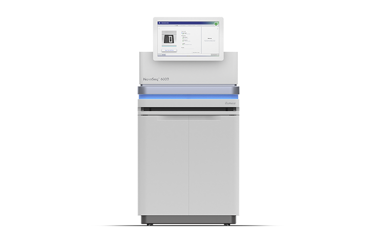
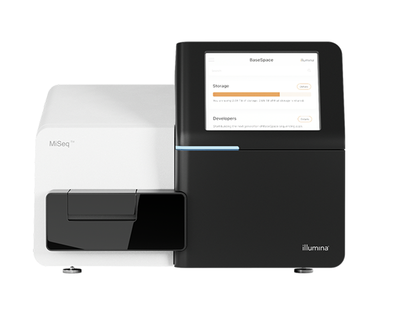
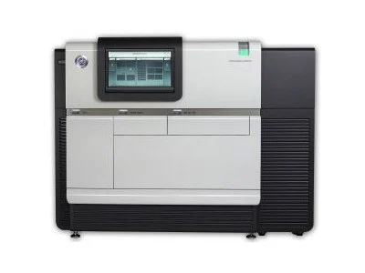
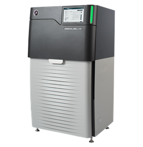
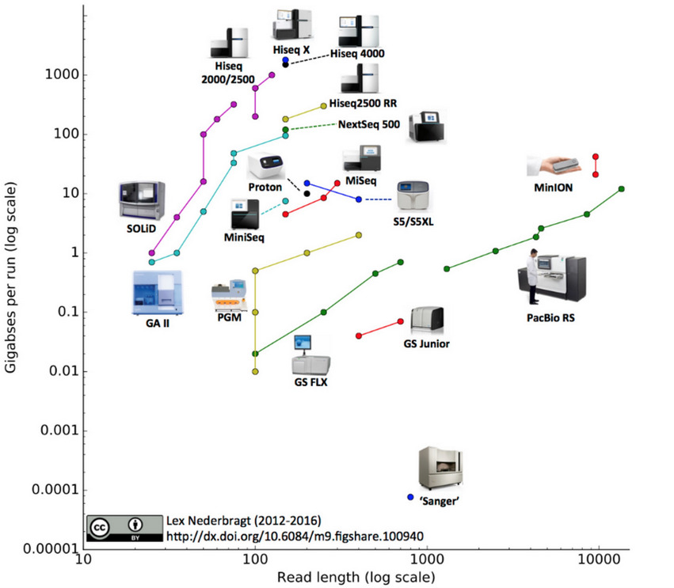
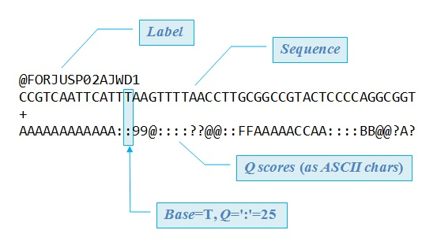

# A Origem dos Dados em Bioinformática: Da Amostra Biológica ao Arquivo Digital

O fluxo de trabalho em bioinformática inicia-se muito antes da linha de comando. A origem primária dos dados reside no ambiente laboratorial, onde o material biológico é convertido em sinais digitais por meio de plataformas de sequenciamento de alto desempenho. Compreender essa cadeia de transformação — da molécula ao arquivo FASTQ — é fundamental para garantir a reprodutibilidade e a qualidade das inferências biológicas posteriores.

---

## 1. Do Laboratório aos Bits: Etapas preparatórias

A jornada do dado envolve uma série de procedimentos meticulosos que visam maximizar a representatividade e a integridade da amostra:

1.  **Extrações e quantificação**: Isolamento do DNA/RNA total, seguido de quantificação precisa (espectrofotometria, Qubit™) e avaliação da integridade (eletroforese em gel ou Bioanalyzer).
2.  **Construção da biblioteca (Library Prep)**: 
    - **Fragmentação**: Físico-enzimática (sonicação ou nebulização) para gerar fragmentos de tamanhos adequados à plataforma.
    - **Reparo e adenilação**: Correção de extremidades rombas e adição de bases adeninas (A-tailing) para ligação eficiente dos adaptadores.
    - **Ligação de adaptadores e índices (Barcodes)**: Adição de sequências universais e códigos de barras moleculares. Esta etapa permite a **multiplexagem** (sequenciamento de várias amostras em uma única corrida).
    - **Amplificação (Bridge PCR ou Emulsion PCR)**: Em plataformas clássicas (ex: Illumina), ocorre a ampliação clonal dos fragmentos para gerar sinal detectável.
3.  **Sequenciamento**: A reação química ou física (variação de corrente iônica) é capturada por sensores ópticos ou eletrônicos, gerando *leitura primária* (*raw reads*).
4.  **Demultiplexação e conversão**: Os sinais brutos são processados pelo *software* do equipamento (*base calling*), atribuídos às suas respectivas amostras (via índices) e exportados no formato padrão.

---

## 2. Repositórios Públicos: A Base de Dados Global

Além dos dados gerados em bancada, a bioinformática moderna é impulsionada pelo compartilhamento aberto de dados. Os principais repositórios internacionais garantem a acessibilidade e a curadoria de petabytes de informação genômica:

- **NCBI SRA** (Sequence Read Archive, EUA).
- **ENA** (European Nucleotide Archive, Europa).
- **DDBJ** (DNA Data Bank of Japan).

> **Nota**: A submissão de dados a esses repositórios é hoje um requisito obrigatório da maioria dos periódicos científicos de alto impacto, promovendo a ciência aberta e permitindo meta-análises.

---

## 3. Plataformas de Sequenciamento: Arquiteturas e Aplicações

A escolha da plataforma define o tipo, o tamanho e a qualidade dos *reads*. Abaixo, uma análise aprofundada das três principais tecnologias, representadas em uma tríade conceitual: **Alta Cobertura (Short-reads)** vs. **Resolução Estrutural (Long-reads)**.

| Característica | Illumina (SBS) | PacBio (SMRT/HiFi) | Oxford Nanopore (ONT) |
| :--- | :--- | :--- | :--- |
| **Princípio** | Síntese por terminadores reversíveis | Sequenciamento de molécula única em tempo real | Detecção de corrente iônica em nanoporos |
| **Tamanho dos Reads** | 50 – 300 pb (paired-end) | 10 – 25 kb (HiFi) / > 100 kb (CLR) | 10 kb – > 1 Mb (ultralongos) |
| **Acurácia (Consenso)** | > 99,9% (Q30) | > 99,9% (HiFi com consenso circular) | ~ 95-99% (melhorando com Dorado) |
| **Custo por Gb** | Muito baixo | Moderado | Variável (mais barato para instrumentos) |
| **Principal Uso** | RNA-seq, ChIP-seq, WGS, GWAS | Montagem *de novo*, Farmacogenômica | Epidemiologia em tempo real, Metagenômica |

### Illumina (Sequencing by Synthesis - SBS)
Atualmente, a espinha dorsal da genômica populacional. Utiliza química de terminadores fluorescentes reversíveis, gerando *clusters* de DNA na *flow cell*. Oferece uma relação custo-benefício inigualável para re-sequenciamento (mapeamento contra um genoma referência).

  
  
  

*Exemplares do ecossistema Illumina: NextSeq (produção), NovaSeq (alto throughput) e MiSeq (validação e amostras pequenas).*

### Pacific Biosciences (PacBio - SMRT e HiFi)
A tecnologia SMRT (*Single-Molecule Real-Time*) utiliza *zero-mode waveguides* (ZMWs) para observar a incorporação de nucleotídeos fluorescentes em tempo real. A grande inovação recente é o modo **HiFi** (High Fidelity), que gera *reads* longos com acurácia > 99,9% através de leituras circulares consensuais (múltiplas passagens sobre a mesma molécula). Essencial para resolver regiões repetitivas e montar genomas completos em um único contig.

  
  

### Oxford Nanopore Technologies (ONT - Sequenciamento em Nanoporo)
Diferencia-se pela **portabilidade** (dispositivos do tamanho de um pendrive, como o MinION) e pela capacidade de gerar *ultra-long reads* (centenas de kilobases). A detecção ocorre por variações na corrente iônica à medida que a fita de DNA/RNA passa pelo poro proteico. Isso permite não só a sequência, mas também a detecção direta de modificações epigenéticas (ex: metilação).

  

### Visão Integrada das Plataformas
A figura abaixo sintetiza a evolução e a cobertura de cada tecnologia em relação ao tamanho do *read* e acurácia.

---

## 4. O Formato FASTQ e a Metrificação da Qualidade (Phred Score)

O padrão **FASTQ** é o *lingua franca* dos dados brutos de sequenciamento. Ele estende o formato FASTA ao incorporar uma pontuação de qualidade para cada base sequenciada.

A estrutura do arquivo compreende **quatro linhas por *read***:

1.  `@` + Identificador da sequência (ex: @EAS139:136:FC706VJ:2:2104:15343:197393).
2.  Sequência de nucleotídeos (A, T, C, G, N).
3.  `+` + (opcionalmente) repetição do identificador.
4.  Linha de qualidades, codificada em caracteres ASCII (geralmente no formato Sanger / Phred+33).

### A Matemática do Escore Phred (Q)
A qualidade de uma base é expressa pelo escore **Phred**, definido pela relação logarítmica com a probabilidade de erro (\(P\)) daquela chamada de base:

\[
Q = -10 \times \log_{10}(P)
\]

| Escore Phred (Q) | Probabilidade de erro | Acurácia da base |
| :---: | :---: | :---: |
| Q10 | 1 em 10 | 90% |
| Q20 | 1 em 100 | 99% |
| Q30 | 1 em 1.000 | 99,9% |
| Q40 | 1 em 10.000 | 99,99% |

> **Implicação prática**: Reads com médias de qualidade abaixo de Q20 (escore 20) são frequentemente podados (*trimming*) nas etapas iniciais de um pipeline, pois bases de baixa qualidade introduzem falsos SNPs e viés na montagem.

  

*Representação esquemática do arquivo FASTQ: identidade, sequência, separador e qualidade codificada em ASCII.*

---

## 5. Conceitos Avançados: Profundidade (Coverage) e *De novo* vs. *Re-sequenciamento*

- **Cobertura (Profundidade)**: Representa o número médio de *reads* que cobrem cada nucleotídeo do genoma alvo. Para montagem *de novo* de bactérias, recomenda-se cobertura entre 50x e 100x. Para detecção de variantes raras em câncer, > 200x é desejável.
- **Abordagens analíticas**:
  - **Re-sequenciamento**: Alinha-se os *reads* contra um genoma referência. Mais rápido e adequado para variantes pontuais (SNPs/INDELs).
  - **Montagem *de novo***: Reconstrói o genoma sem referência, utilizando algoritmos de grafos (*de Bruijn graph* para short-reads; *Overlap-Layout-Consensus* para long-reads). Fundamental para organismos não-modelo.

---

A qualidade e a origem dos dados determinam o sucesso de toda a análise *downstream*. Portanto, a familiaridade com as plataformas, os formatos de arquivo e os critérios de qualidade (Phred) é o primeiro passo para a formação de um bioinformata competente e crítico.
