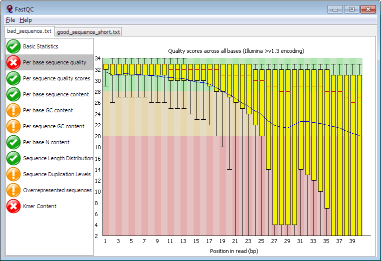

# Módulo 1: Infraestrutura Computacional e Controle de Qualidade dos Dados Brutos

A construção de um *pipeline* robusto em genômica microbiana inicia-se com dois pilares fundamentais: (i) a **reprodutibilidade do ambiente computacional** e (ii) a **integridade estatística dos dados de entrada** (*raw reads*). Este módulo estabelece as bases práticas e conceituais para a preparação de dados de sequenciamento do tipo *paired-end* (Illumina), desde a configuração do *shell* até a validação por métricas de qualidade (escore Phred). Todo o processo segue os princípios FAIR (*Findable, Accessible, Interoperable, Reusable*) para dados científicos.

---

## 1.1 Configuração do Ambiente de Análise: Reprodutibilidade e Gerenciamento de Pacotes

### Contextualização Metodológica

Em projetos de bioinformática, a heterogeneidade de dependências entre ferramentas (versões de Python, Java, bibliotecas C) é uma das principais fontes de erro não documentado. Para mitigar esse viés, adotamos o gerenciador de pacotes **Mamba** (uma reimplementação em C++ do Conda, otimizada para resolução de dependências), que nos permite criar ambientes virtuais isolados. Esta prática garante que os resultados sejam replicáveis em diferentes máquinas (local, HPC ou nuvem).

### Procedimentos Operacionais

1.  **Atualização do sistema base** (para pacotes essenciais do SO):
    ```bash
    sudo apt update && sudo apt upgrade -y
    sudo apt install -y build-essential wget git unzip screen default-jre
    ```

2.  **Instalação e configuração do Mamba** (substitui o Conda padrão por sua maior velocidade):
    ```bash
    # Baixar e instalar o Miniforge (que já inclui o mamba)
    wget [https://github.com/conda-forge/miniforge/releases/latest/download/Miniforge3-Linux-x86_64.sh](https://github.com/conda-forge/miniforge/releases/latest/download/Miniforge3-Linux-x86_64.sh)
    bash Miniforge3-Linux-x86_64.sh -b -p $HOME/miniforge3
    
    # Inicializar o Conda/Mamba no terminal e atualizar a sessão
    ~/miniforge3/bin/conda init bash
    source ~/.bashrc
    ```

3.  **Criação do ambiente específico para o curso** (evita conflitos com o sistema):
    ```bash
    mamba create -n genomica_qc -c bioconda -c conda-forge \
        fastqc trimmomatic sra-tools seqtk multiqc
    conda activate genomica_qc
    ```
    > **Nota acadêmica**: A opção `-n` nomeia o ambiente. Ao ativá-lo (`conda activate`), todas as ferramentas ficam disponíveis exclusivamente nessa sessão, isolando as versões das bibliotecas.

4.  **Sessões persistentes (`screen` ou `tmux`)**: Para processos longos (downloads ou trimagens pesadas), utilize `screen -S qc_session` para manter o terminal ativo mesmo em desconexões de rede.

---

## 1.2 Aquisição de Dados Públicos: O Repositório SRA e o *SRA Toolkit*

### Fundamentos da Busca por Dados

Os dados brutos de sequenciamento estão depositados no **Sequence Read Archive (SRA)**, mantido pelo NCBI. Para acessá-los, utilizamos o *SRA Toolkit*, que converte o formato binário compactado (`.sra`) para o padrão universal FASTQ. A escolha do número de acesso (*Accession Number*) — como o `SRR10461876` (genoma de *Escherichia coli*) — deve ser feita com base na qualidade da biblioteca (estudos com profundidade ≥ 50x são recomendados para montagem *de novo* bacteriana).

### Comandos e Boas Práticas

```bash
# Download e descompactação do SRA Toolkit (versão estável mais recente)
wget [https://ftp.ncbi.nlm.nih.gov/sra/sdk/current/sratoolkit.current-ubuntu64.tar.gz](https://ftp.ncbi.nlm.nih.gov/sra/sdk/current/sratoolkit.current-ubuntu64.tar.gz)
tar -xzf sratoolkit.current-ubuntu64.tar.gz
```

# Adiciona os executáveis da versão baixada ao PATH do sistema
```bash
export PATH=$HOME/sratoolkit.*/bin:$PATH
```

# Configuração obrigatória inicial (necessária uma única vez para liberar downloads externos)
# Na tela interativa que se abrir, pressione 'x' e depois confirme para salvar e sair
```bash
vdb-config --interactive
```

# Organização dos dados (estrutura de diretórios)
```bash
mkdir -p raw_data
cd raw_data
```

# Download dos reads paired-end com compressão integrada (--gzip)
```bash
fastq-dump --split-files --gzip SRR10461876
cd ..
```

**Detalhamento técnico dos *flags***:
- `--split-files`: Obrigatório para dados *paired-end*. Gera dois arquivos: `_1.fastq.gz` (forward) e `_2.fastq.gz` (reverse).
- `--gzip`: Compacta os arquivos em tempo real, economizando ~70% de espaço em disco, sendo uma prática padrão em *pipelines* produtivos.

---

## 1.3 Avaliação Estatística da Qualidade com FastQC

### O Paradigma da Escala Phred

A confiabilidade de cada base chamada pelo sequenciador é expressa pela **escala Phred (Q)**, definida pela probabilidade logarítmica de erro:

$$
Q = -10 \times \log_{10}(P_{\text{erro}})
$$

| Escore (Q) | Prob. de Erro | Acurácia | Interpretação para Montagem |
|:---:|:---:|:---:|:---|
| Q10 | 1/10 | 90% | **Crítico** – descartar |
| Q20 | 1/100 | 99% | **Limiar mínimo** para extremidades |
| Q30 | 1/1.000 | 99,9% | **Ideal** – bases confiáveis |
| Q40 | 1/10.000 | 99,99% | Excelente (raro em Illumina) |

### Execução e Geração de Relatórios

```bash
mkdir -p qc_raw
fastqc raw_data/*.fastq.gz -o qc_raw/
```

O FastQC gera um relatório HTML com 12 métricas. Para uma amostra bacteriana, os critérios de "Aprovação" (*Pass*) ou "Alerta" (*Warning*) devem ser interpretados assim:

| Módulo FastQC | O que avaliar | Problema crítico (Fail) |
|:---|:---|:---|
| **Per Base Quality** | Boxplots das posições | Mediana caindo abaixo de Q20 |
| **Per Sequence GC** | Distribuição do %GC | Pico duplo (sugere contaminação) |
| **Adapter Content** | Presença de adaptadores | Curva acumulativa > 5% |
| **Overrepresented Sequences** | Contaminantes comuns | Presença de vetores ou rRNA 16S |

> **Prática moderna**: Para projetos com muitas amostras, utilize o **MultiQC** para agregar todos os relatórios do FastQC em um único *dashboard* interativo: `multiqc qc_raw/ -o multiqc_report/`.


*Exemplo típico de gráfico "Per Base Sequence Quality" no FastQC. A região em vermelho (extremidades) indica onde a trimagem será necessária.*

---

## 1.4 Preprocessamento: Trimagem e Filtragem com Trimmomatic

### Justificativa Estatística para a Limpeza dos Dados

*Reads* brutos contêm artefatos de bancada (adaptadores, primers) e bases de baixa qualidade que inflacionam o número de *k-mers* errôneos, fragmentando a montagem *de novo* em *contigs* desnecessariamente curtos. A trimagem não é arbitrária; baseia-se na relação sinal-ruído da química de sequenciamento (a qualidade decai exponencialmente após ~100 ciclos em equipamentos MiSeq).

### Parâmetros Críticos e Lógica Algorítmica

O comando abaixo utiliza o **Trimmomatic** em modo *paired-end* (PE). Entenda cada parâmetro:

```bash
# Definir o diretório base para facilitar a execução
TRIMMOMATIC_DIR=$(pwd)/Trimmomatic-0.39
mkdir -p trimmed_reads

java -jar ${TRIMMOMATIC_DIR}/trimmomatic-0.39.jar PE \
raw_data/SRR10461876_1.fastq.gz raw_data/SRR10461876_2.fastq.gz \
trimmed_reads/SRR10461876_1_paired.fastq.gz trimmed_reads/SRR10461876_1_unpaired.fastq.gz \
trimmed_reads/SRR10461876_2_paired.fastq.gz trimmed_reads/SRR10461876_2_unpaired.fastq.gz \
ILLUMINACLIP:${TRIMMOMATIC_DIR}/adapters/TruSeq3-PE.fa:2:30:10 \
LEADING:3 TRAILING:3 SLIDINGWINDOW:4:15 MINLEN:36
```

| Parâmetro | Significado Matemático/Biológico | Valor adotado e justificativa |
|:---|:---|:---|
| `ILLUMINACLIP` | Remove adaptadores usando alinhamento local. <br>`2:30:10` = mismatches máximos (2), <br>threshold para *palindromic clipping* (30) e *simple clipping* (10). | Garante remoção específica sem perder fragmentos biológicos inseridos. |
| `LEADING:3` | Corta bases do início (5') com Q < 3. | Elimina ruído gerado pela fase inicial da polimerização. |
| `TRAILING:3` | Corta bases do fim (3') com Q < 3. | Compensa a degradação natural da qualidade na extremidade. |
| `SLIDINGWINDOW:4:15` | Janela deslizante de 4 bases; se a média Q < 15, corta a partir daquela posição. | Algoritmo adaptativo que remove quedas repentinas de qualidade no meio do *read*. |
| `MINLEN:36` | Descarta *reads* que ficaram com < 36 pb. | Este valor é crítico: deve ser **maior que o maior k-mer** utilizado na montagem (ex: SPAdes usa k até 127, logo 36 é seguro). |

> **Atenção**: O comando gera dois tipos de saída: `_paired` (reads que mantiveram seu par) e `_unpaired` (órfãos). Para montagem *de novo*, utilize prioritariamente os arquivos `_paired`, que preservam a informação de distância entre os fragmentos (*insert size*).

### Alternativa Moderna (Fastp)
Para um fluxo mais rápido e integrado (que já gera relatório JSON/HTML), considere:
```bash
fastp -i raw_data/SRR10461876_1.fastq.gz -I raw_data/SRR10461876_2.fastq.gz \
-o trimmed_reads/SRR10461876_1.fastq.gz -O trimmed_reads/SRR10461876_2.fastq.gz \
--detect_adapter_for_pe -q 15 -u 30 -n 5 -l 36
```
*(Nota: Fastp é escrito em C++ e é ~2x mais rápido que Trimmomatic, sendo uma excelente substituição moderna).*

---

## 1.5 Validação Pós-Processamento: Reavaliação de Qualidade

### Objetivo da Etapa

Antes de prosseguir para a montagem, devemos comparar os relatórios pré e pós-trimagem para quantificar a eficácia do filtro. Idealmente, o relatório pós-trimagem deve mostrar:

- **Per Base Quality**: Boxplots completamente na zona verde (Q > 30).
- **Adapter Content**: Curva plana em 0%.
- **GC Content**: Curva normal e unimodal, centrada no esperado para o táxon (ex: ~50,8% para *E. coli*).

### Comandos e Verificação Final

```bash
mkdir -p qc_trimmed
fastqc trimmed_reads/*.fastq.gz -o qc_trimmed/
```

**Checklist de aprovação** para dar sequência ao *pipeline* (Montagem com SPAdes):

1.  [ ] **Número de reads** manteve-se ≥ 90% do total original (perda aceitável).
2.  [ ] **Qualidade média** do arquivo *forward* e *reverse* > Q30 em todas as posições.
3.  [ ] **Ausência de overrepresented sequences** (contaminantes).
4.  [ ] **Tamanho médio dos reads** está acima do `MINLEN` definido.
