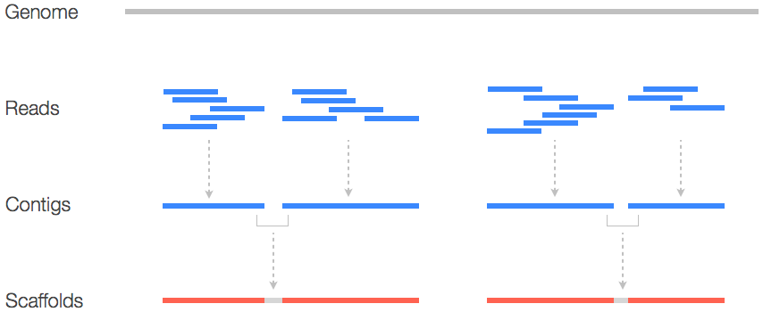
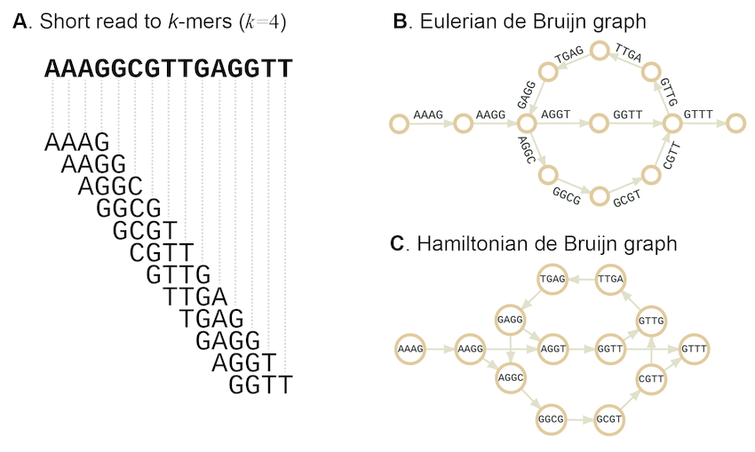
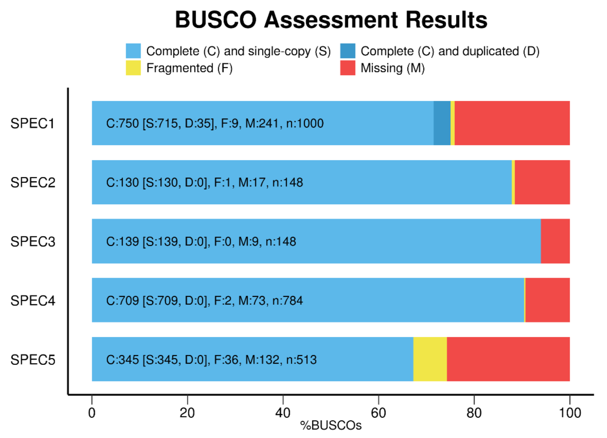

# Módulo 2: Montagem do Genoma – Reconstrução e Validação Estrutural

Este módulo aborda a reconstrução do genoma a partir dos *reads* curtos (já filtrados e trimados) e a avaliação da qualidade da montagem, utilizando métricas de contiguidade, completude e acurácia. A montagem *de novo* é uma etapa central em projetos de genômica, pois permite obter a sequência do genoma sem depender de um referencial pré‑existente, sendo essencial para organismos não‑modelo, cepas emergentes ou estudos metagenômicos.

---

## Objetivo do Processo de Montagem e Etapas

A figura abaixo sintetiza o fluxo completo da montagem *de novo*: desde a correção de erros nos *reads* até a geração de *contigs* e *scaffolds*, passando pela resolução de repetições e pela validação final da qualidade.


*Fluxograma das principais etapas da montagem *de novo*: correção de erros → construção do grafo de Bruijn → resolução de repetições → geração de contigs/scaffolds → avaliação da qualidade.*

---

## 2.1 Montagem de Genomas (*De Novo Assembly*)

**Objetivo**: Juntar os *reads* filtrados e de alta qualidade para formar *contigs* (sequências contíguas) e, idealmente, *scaffolds* (*contigs* ordenados e orientados por informações de pareamento, como a distância entre os pares de *reads*). A montagem *de novo* significa que não usamos um genoma de referência pré‑existente; portanto, o algoritmo deve reconstruir a sequência original a partir da sobreposição dos fragmentos.

**Ferramenta principal**: **SPAdes** (*St. Petersburg Genome Assembler*), amplamente utilizado para genomas bacterianos e arqueais, com suporte a dados Illumina, Ion Torrent e até mesmo *reads* híbridos (curtos e longos).

### Comandos Básicos

```bash
# Instalação via gerenciador de pacotes do sistema
sudo apt install -y spades

# Criação do diretório para armazenar os resultados da montagem
mkdir assembly

# Execução principal do SPAdes em modo rigoroso
spades.py --careful -o assembly/SRR10461876_assembly \
-1 trimmed_reads/SRR10461876_1_paired.fastq \
-2 trimmed_reads/SRR10461876_2_paired.fastq \
--cov-cutoff auto
```

### Descrição Detalhada dos Parâmetros e Comandos

- **`sudo apt install -y spades`**: Instala o montador de genomas SPAdes. O SPAdes é um dos montadores mais populares e robustos para procariotos, sendo capaz de lidar com diferentes tecnologias de sequenciamento e de incorporar *reads* de diferentes comprimentos.

- **`mkdir assembly`**: Cria um diretório específico para organizar todos os arquivos gerados durante e após a montagem, facilitando a gestão dos dados.

- **`spades.py --careful -o assembly/SRR10461876_assembly`**: Executa o script principal do SPAdes.
  - **`--careful`**: Ativa um modo de montagem mais rigoroso. Ele realiza um passo adicional de correção de erros e tenta reduzir o número de erros de montagem e quimeras (*contigs* que combinam sequências de regiões não adjacentes do genoma). Esse modo é especialmente útil para dados com cobertura irregular ou presença de contaminação. Embora possa aumentar o tempo de execução, geralmente resulta em uma montagem de maior qualidade.
  - **`-o assembly/SRR10461876_assembly`**: Define o diretório de saída onde todos os arquivos gerados pelo SPAdes serão armazenados.
  - **`-1 trimmed_reads/SRR10461876_1_paired.fastq`**: Especifica o arquivo de *reads* do *forward* pareados, que foram previamente submetidos à trimagem e filtragem de qualidade.
  - **`-2 trimmed_reads/SRR10461876_2_paired.fastq`**: Especifica o arquivo de *reads* do *reverse* pareados, também já processados.
  - **`--cov-cutoff auto`**: Calcula automaticamente o limiar de cobertura para remover *k‑mers* com profundidade extremamente baixa (possíveis erros de sequenciamento) ou extremamente alta (possíveis repetições ou DNA contaminante), melhorando a confiabilidade do grafo.

### Principais Arquivos de Saída do SPAdes

O diretório de saída (`assembly/SRR10461876_assembly/`) conterá vários arquivos; os mais importantes são:

- **`contigs.fasta`**: Este é o arquivo principal, contendo todas as sequências contíguas (*contigs*) montadas. Para procariotos, o objetivo é ter o menor número possível de *contigs*, idealmente um único cromossomo circular (mais alguns plasmídeos, se presentes). Quanto menor o número de *contigs*, mais contígua é a montagem.

- **`scaffolds.fasta`**: Se o SPAdes conseguir usar as informações de pareamento (*paired‑end*) para ordenar e orientar *contigs* em fragmentos maiores, eles serão colocados neste arquivo. *Scaffolds* geralmente são mais longos que os *contigs* e preenchem lacunas com bases 'N' quando a ordem é inferida, mas a sequência exata é desconhecida.

- **`assembly_graph.gfa`**: O grafo de montagem no formato GFA (*Graph Fragment Assembly*). Pode ser visualizado com ferramentas como **Bandage**, permitindo inspeção manual de regiões repetitivas, *bubbles* (possíveis polimorfismos) e *dead‑ends*.

- **`params.txt`**: Arquivo com os parâmetros usados na montagem, útil para reprodutibilidade e documentação.

- **`spades.log`**: Arquivo de *log* detalhado da execução, contendo mensagens de aviso, erros e estatísticas intermediárias, essencial para depuração.

### Conceito Fundamental: *K‑mers* e o Grafo de Bruijn

Montadores *de novo* como o SPAdes funcionam construindo um **grafo de Bruijn** (*de Bruijn graph*). O processo é o seguinte:

1. Os *reads* são decompostos em todas as subsequências de comprimento fixo \(k\), chamadas ***k‑mers***.
2. Cada *k‑mer* único torna‑se um **nó** no grafo.
3. Dois nós são conectados por uma **aresta** direcionada se houver uma sobreposição de \((k-1)\) bases entre eles (por exemplo, o *k‑mer* `ACG` se sobrepõe a `CGT` para formar a sequência `ACGT`).
4. As sobreposições entre esses *k‑mers* são usadas para construir o grafo, onde caminhos (*paths*) através do grafo representam sequências contíguas do genoma. O SPAdes testa múltiplos tamanhos de *k‑mers* automaticamente para encontrar a melhor montagem, equilibrando sensibilidade (resolução de regiões de baixa cobertura) e especificidade (resolução de repetições longas).

A figura abaixo ilustra esquematicamente a estrutura de um grafo de Bruijn:


*Representação de um grafo de Bruijn: cada nó é um *k‑mer*, arestas indicam sobreposições. Caminhos lineares representam regiões não repetitivas; bifurcações (*bubbles*) podem indicar polimorfismos ou erros de sequenciamento.*

> **Abordagens modernas alternativas**: Embora o SPAdes seja o *gold standard* para Illumina, para genomas circulares (bactérias) o **Unicycler** é uma excelente opção, especialmente quando combinado com *long‑reads* (Nanopore/PacBio) para fechamento do cromossomo em um único *contig* circular. Para dados exclusivamente de *long‑reads*, montadores baseados em OLC (*Overlap‑Layout‑Consensus*) como **Flye** ou **Raven** são mais adequados.

---

## 2.2 Avaliação da Qualidade da Montagem com QUAST

**Objetivo**: Avaliar métricas importantes da montagem para determinar sua **completude**, **contiguidade** e **acurácia**. Esta etapa é crucial para entender a qualidade do genoma reconstruído e para decidir se a montagem é adequada para análises posteriores (anotação, comparação, etc.).

**Ferramenta**: **QUAST** (*Quality Assessment Tool for Genome Assemblies*) – disponível em [https://github.com/ablab/quast](https://github.com/ablab/quast).

### Comandos de Execução

```bash
# Instalação via pip (ou apt, dependendo da distribuição)
sudo pip install quast

# Criação do diretório para armazenar os relatórios
mkdir quast_report

# Execução da avaliação (sem genoma de referência)
quast.py assembly/SRR10461876_assembly/contigs.fasta -o quast_report/

# Opcional: com genoma de referência (ex: cepa próxima disponível no NCBI)
# quast.py assembly/contigs.fasta -r reference.fasta -o quast_report/
```

**Forma de Execução**: O relatório HTML gerado em `quast_report/` deve ser aberto em um navegador web para uma análise detalhada e interativa. Você pode transferir o arquivo para sua máquina local (via `scp` ou `sftp`) ou abri‑lo diretamente se estiver em um ambiente gráfico.

### Descrição Detalhada dos Comandos

- **`sudo pip install quast`** (ou `sudo apt install -y quast`): Instala a ferramenta QUAST no sistema.

- **`mkdir quast_report`**: Cria um diretório dedicado para armazenar os relatórios gerados pelo QUAST.

- **`quast.py assembly/SRR10461876_assembly/contigs.fasta -o quast_report/`**: Executa o QUAST sobre o arquivo `contigs.fasta` gerado pelo SPAdes. O parâmetro `-o` define o diretório de saída.

- **`-r reference.fasta`** (opcional): Se um genoma de referência estiver disponível, pode‑se fornecê‑lo para obter métricas adicionais, como alinhamento, cobertura e número de *misassemblies* (rearranjos estruturais). Isso é útil para comparar a montagem com uma cepa conhecida, mas não é obrigatório para cepas novas.

### Métricas de Qualidade da Montagem (Explicadas em Detalhe)

O QUAST gera um relatório abrangente com várias estatísticas. As métricas mais importantes para interpretação biológica são:

- **Número de contigs**: Total de sequências contíguas geradas. Para um genoma procarioto, o ideal é ter um número baixo (próximo de 1 para um cromossomo circular, mais alguns para plasmídeos). Um número muito alto indica uma montagem fragmentada, possivelmente devido a baixa cobertura, repetições não resolvidas ou contaminação.

- **Tamanho total do genoma montado (*Total length*)**: Soma dos comprimentos de todos os *contigs*. Deve ser próximo ao tamanho esperado do genoma do organismo (ex: 4‑5 Mbp para muitas bactérias). Desvios significativos (acima de 10%) podem indicar contaminação (se maior) ou montagem incompleta (se menor).

- **N50**: Métrica de contiguidade. É o comprimento do *contig* tal que 50% do comprimento total do genoma montado está contido em *contigs* de tamanho igual ou maior que esse valor. Um N50 maior indica uma montagem mais contígua (menos fragmentada). Por exemplo, se o N50 for 1 Mbp, significa que metade do genoma está em *contigs* de 1 Mbp ou mais. Para genomas bacterianos, espera‑se N50 > 100 kb em montagens de boa qualidade.

- **NGA50**: Similar ao N50, mas considera a montagem em relação a um genoma de referência (se fornecido). É uma métrica mais rigorosa, pois leva em conta a ordem e orientação corretas.

- **Maior *contig* (*Largest contig*)**: Comprimento do *contig* mais longo na montagem. Em uma montagem excelente, o maior *contig* pode se aproximar do tamanho do cromossomo inteiro.

- **Conteúdo GC (%GC)**: Porcentagem de bases Guanina e Citosina no genoma montado. Deve ser consistente com o conteúdo GC esperado para a espécie (ex: *E. coli* ~50,8%). Desvios > 5% indicam possível contaminação por outro organismo ou viés na montagem.

- **Número de Ns (*bases indeterminadas*)**: Total de bases 'N' (qualquer base) presentes nos *contigs*. Um número alto de Ns indica a presença de lacunas (*gaps*) na montagem, geralmente em regiões repetitivas que não puderam ser completamente resolvidas. Idealmente, esse valor deve ser zero para dados Illumina com boa cobertura.

- **Misassemblies** (disponível apenas se uma referência for fornecida): Pontos onde a montagem difere significativamente do genoma de referência, indicando erros estruturais como inversões, translocações ou fusões incorretas. Valores > 0 exigem inspeção manual em visualizadores de genoma (ex: IGV, Artemis) para verificar se são artefatos ou variantes reais.

- **Gráficos do QUAST**: O relatório HTML inclui gráficos como a distribuição de comprimentos de *contigs*, que visualiza a contiguidade da montagem, e gráficos de cobertura (se referência fornecida).

> **Alerta crítico**: O N50 é uma métrica de contiguidade, **não** de acurácia. Uma montagem pode ter N50 elevado e conter múltiplos *misassemblies* (quimeras). Por isso, a avaliação com BUSCO (próxima seção) é complementar e obrigatória para garantir que os genes essenciais estão presentes e intactos.

---

## 2.3 Avaliação de Completude Gênica com BUSCO

Além da contiguidade física (avaliada pelo QUAST), é fundamental verificar a **completude funcional e evolutiva** do genoma montado. O **BUSCO** (*Benchmarking Universal Single‑Copy Orthologs*) avalia a presença de um conjunto de genes ortólogos que são universalmente conservados em cópia única em todos os membros de uma linhagem evolutiva, com base na base de dados **OrthoDB** (atualmente versão 10). Essa análise permite estimar quanto do genoma foi efetivamente recuperado em termos de conteúdo gênico essencial.

### 1. Instalação do BUSCO

A instalação é recomendada via **Conda/Mamba** para garantir a correta resolução de dependências:

```bash
# Criação de um ambiente dedicado para o BUSCO
conda create -n busco -c conda-forge -c bioconda busco
conda activate busco
```

### 2. Preparação dos Arquivos e da Base de Dados (*Lineage*)

Você precisará de:
- O arquivo da montagem genômica em formato FASTA (ex: `genome.fna`, que pode ser `contigs.fasta` ou `scaffolds.fasta` — prefira `scaffolds` por serem mais longos).
- A linhagem (*lineage*) apropriada do OrthoDB para procariotos, como:
  - `bacteria_odb10` (para bactérias)
  - `archaea_odb10` (para arqueias)

O download da base de ortólogos pode ser feito manualmente (útil para execuções offline ou para controle de versão):

```bash
wget https://busco-data.ezlab.org/v10/data/lineages/bacteria_odb10.2020-09-10.tar.gz
tar -xzf bacteria_odb10.2020-09-10.tar.gz
```

### 3. Execução do BUSCO

O comando típico para uma montagem genômica bacteriana é:

```bash
busco -i genome.fna \
-o busco_bacteria_output \
-l bacteria_odb10 \
-m genome \
--cpu 8
```

**Parâmetros explicados**:

- **`-i`**: Arquivo FASTA com a montagem genômica (ex: `assembly/SRR10461876_assembly/scaffolds.fasta`).
- **`-o`**: Nome do diretório de saída (ex: `busco_bacteria_output`).
- **`-l`**: Diretório ou nome da linhagem (`bacteria_odb10`). Se o diretório não existir, o BUSCO tentará baixá‑lo automaticamente.
- **`-m genome`**: Modo de análise. Como a entrada é uma montagem genômica completa, usamos `genome` (outros modos: `proteome` para proteínas, `transcriptome` para transcriptomas).
- **`--cpu`**: Número de *threads* a serem utilizadas para processamento paralelo.

### 4. Interpretação dos Resultados

O relatório principal estará em:

```
busco_bacteria_output/short_summary_*.txt
```

Exemplo de saída típica:

```
C:95.2%[S:93.5%,D:1.7%],F:2.3%,M:2.5%,n:124
```

**Legenda detalhada**:

| Código | Significado | Interpretação qualitativa para montagens bacterianas |
|:---|:---|:---|
| **C (Completo)** | Genes BUSCO encontrados completos (inclui S + D). | \(> 95\%\) = Excelente (qualidade de referência). <br> \(80–95\%\) = Bom. <br> \(< 70\%\) = Fragmentado (necessita melhorias na montagem). |
| **S (Single‑copy)** | Genes completos e em cópia única. | Valor esperado para genomas haploides. Um alto percentual indica baixa contaminação e boa resolução de repetições. |
| **D (Duplicated)** | Genes completos, mas duplicados (duas ou mais cópias). | Pode indicar contaminação por duas cepas diferentes, genoma diploide (em organismos que não são haploides), ou montagem com redundâncias (ex: *scaffolds* sobrepostos devido a não resolução de repetições). |
| **F (Fragmentados)** | Genes encontrados, mas incompletos (quebrados em múltiplos *contigs*). | Sugere que a montagem está fragmentada nessas regiões, possivelmente por baixa cobertura ou repetições não resolvidas. |
| **M (Missing)** | Genes totalmente ausentes na montagem. | Regiões do genoma que não foram recuperadas; podem indicar lacunas verdadeiras ou perda de material genético. |
| **n** | Total de grupos de ortólogos esperados para a linhagem. | Para bactérias (OrthoDB v10), \(n = 124\). |

### 5. Dicas de Boas Práticas e Execução Automática

- **Uso da flag `--auto-lineage-prok`**: Se você não tiver certeza da linhagem correta (bactéria ou arqueia), utilize o modo automático, que detecta o domínio e baixa a base de dados apropriada na primeira execução:
  ```bash
  busco -i assembly/SRR10461876_assembly/scaffolds.fasta \
  -o busco_output \
  -m genome \
  --auto-lineage-prok \
  --cpu 8
  ```

- **Execução offline**: Após o primeiro uso (quando a base de dados foi baixada), você pode adicionar a flag `--offline` para rodar sem acesso à internet, economizando tempo e recursos em clusters restritos.

- **Controle total**: Para ambientes onde se deseja especificar explicitamente a linhagem, você ainda pode usar `-l bacteria_odb10` ou `-l archaea_odb10` em vez do modo automático.

### 6. Geração de Gráfico para Análise Visual dos Resultados

O BUSCO oferece um script integrado para gerar um gráfico de barras que consolida as proporções de genes completos (C), fragmentados (F) e ausentes (M), facilitando a interpretação e a comunicação dos resultados em relatórios e artigos.

**Requisitos**:
- Python 3
- Pacotes: `matplotlib`, `seaborn`, `pandas` (instaláveis via conda)

```bash
# Instalação das dependências
conda install matplotlib seaborn pandas -y

# Geração do gráfico a partir do diretório de resultados
busco --plot busco_output/
```

Ajuste o caminho `DIRECTORY` para o diretório onde estão os arquivos `short_summary.*.txt` gerados pelo BUSCO.


*Exemplo de gráfico gerado pelo BUSCO. A distribuição entre genes completos (azul), fragmentados (laranja) e ausentes (cinza) fornece uma fotografia instantânea da integridade evolutiva da montagem.*

---

## Síntese e Critérios de Aprovação da Montagem

Para que uma montagem seja considerada de alta qualidade e apta para submissão a repositórios (NCBI/ENA) ou para análises posteriores (anotação, genômica comparativa), ela deve atender cumulativamente aos seguintes critérios mínimos:

1. **QUAST**:
   - N50 \(> 50\) kb (idealmente \(> 100\) kb).
   - Número de *contigs* \(< 100\) (idealmente \(< 20\)).
   - Tamanho total montado dentro de \(\pm 10\%\) do tamanho esperado.
   - GC% compatível com o táxon.
   - Número de bases 'N' próximo de zero (lacunas mínimas).

2. **BUSCO**:
   - Completude (C) \(> 95\%\).
   - Genes fragmentados (F) \(< 2\%\).
   - Genes ausentes (M) \(< 2\%\).

3. **Inspeção visual complementar**:
   - Utilize o **Bandage** para carregar o arquivo `assembly_graph.gfa` e inspecionar manualmente o grafo de montagem. Em genomas bacterianos circulares, espera‑se que o cromossomo principal forme um *loop* fechado, indicando que a montagem foi bem‑sucedida.
   - Verifique a ausência de *bubbles* ou *dead‑ends* não resolvidos que possam indicar erros de montagem.

Aprovado este *checklist*, os dados estão prontos para a etapa de **Anotação Genômica** (Módulo 3), onde transformaremos as sequências montadas em conhecimento funcional — identificando genes, vias metabólicas, fatores de virulência e elementos móveis.
```
